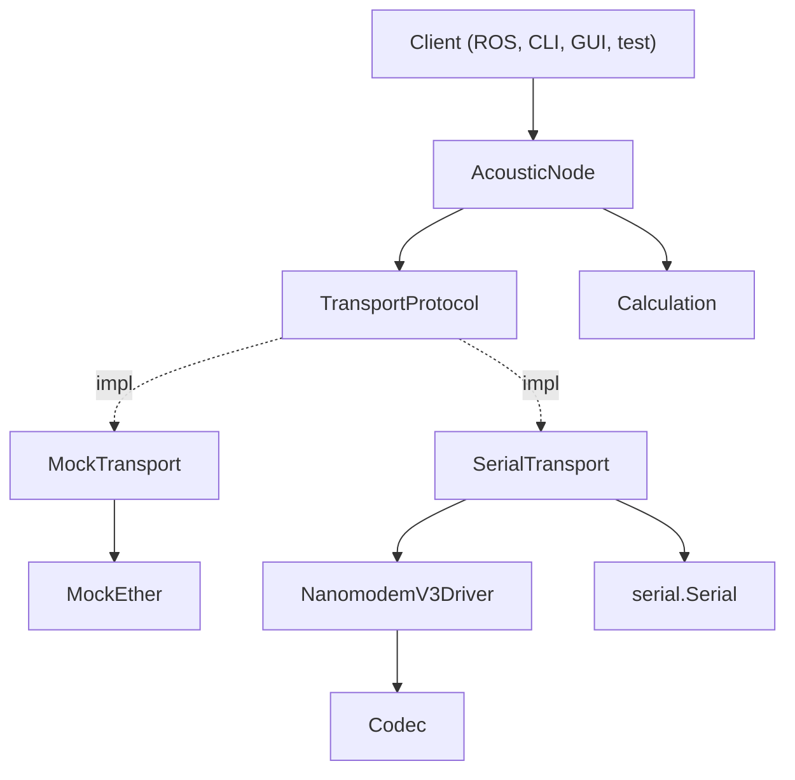

# Nanomodem Library

Python library for underwater acoustic positioning — trilaterate a submerged node's position using a network of surface beacons and acoustic range measurements.

## Installation

### For Users (Library)

Install the core library (includes `scipy` and `pyserial`):

```bash
pip install git+https://github.com/foxpoint-se/nanomodem-python.git
```

To include the demo scenarios and their dependencies:

```bash
pip install "nanomodem[demo] @ git+https://github.com/foxpoint-se/nanomodem-python.git"
```

### For Developers (Local)

Clone and set up the full environment (requires `uv`):

```bash
git clone https://github.com/foxpoint-se/nanomodem-python.git
cd nanomodem-python
make install
```

Run `make help` to see all available commands:

```bash
make test           # Run all tests
make lint           # Check for style and logical errors (Ruff)
make format         # Automatically format code (Ruff)
make typecheck      # Run strict type checking (Mypy)
make verify-dist    # Verify the core library is installable in a clean environment
make verify-dist-gui  # Verify the GUI extra is installable in a clean environment
```

## Usage

### Demo Scenarios (requires `[demo]` extra)

**4-node mock simulation (1 host + 3 beacons):**

```bash
uv run nanomodem-demo

# OR
source .venv/bin/activate
nanomodem-demo
```

**Single node UI (requires node ID):**

```bash
uv run nanomodem-node 001

# OR
source .venv/bin/activate
nanomodem-node 001
```

### Real Hardware (Single Modem on Serial)

```python
from nanomodem import AcousticNode, SerialTransport, NanomodemV3Driver, Codec, Coord

# Wire up: codec -> driver -> transport -> node
driver = NanomodemV3Driver(codec=Codec())
transport = SerialTransport(node_id="001", port="/dev/ttyUSB0", driver=driver)
node = AcousticNode(node_id="001", transport=transport)

transport.start()

node.set_position(Coord(lat=63.0, lon=10.0))
node.broadcast_position()    # Announce to other nodes
node.request_range("002")    # Ping another node
# ... incoming messages are delivered via on_message callback ...

transport.stop()
```

### Two Mock Nodes (No Hardware)

```python
from nanomodem import AcousticNode, MockEther, MockTransport, Coord

ether = MockEther()

node_a = AcousticNode(
    node_id="001",
    transport=MockTransport("001", ether),
    position=Coord(lat=63.0, lon=10.0),
)
node_b = AcousticNode(
    node_id="002",
    transport=MockTransport("002", ether),
)

# Node A broadcasts its position, Node B receives it
node_a.broadcast_position()
print(node_b.get_known_nodes())  # Node B now knows about Node A
```

### CLI

```bash
python3 -m nanomodem                                    # Mock demo (no hardware)
python3 -m nanomodem --port /dev/ttyUSB0 --node-id 001  # Real hardware
```

For complete scenarios with GUI, trilateration, and multi-node setups, see `src/nanomodem/demo/scenarios/`.

## Architecture



**Pluggable design**: all core interfaces live in `protocols.py`. Swap implementations without changing core logic.

**AcousticNode** is the only stateful class. It holds its own position, depth, known nodes, and distances. Orchestrates communication and calculation via injected dependencies (transport, calculation).

**TransportProtocol** defines `broadcast_position(coord, depth)`, `request_range(target_id)`, and `on_message(callback)`. Two implementations:

- **MockTransport** routes typed `Message` objects through a shared **MockEther** bus. No codec or driver needed.
- **SerialTransport** wraps a serial port. Delegates command formatting and response parsing to a **DriverProtocol** implementation.

**NanomodemV3Driver** handles the nanomodem v3 modem protocol: formats `$P`, `$B` commands and parses `#R`, `#B`, `#U` responses. Uses a **Codec** for message body encoding/decoding.

**Calculation** is stateless and pure. Trilateration (scipy least_squares), 3D-to-2D projection, timestamp-to-distance conversion.

## Project Structure

```text
.
├── src/
│   └── nanomodem/              # Core library
│       ├── node.py             # AcousticNode — the only stateful class
│       ├── protocols.py        # TransportProtocol, DriverProtocol, etc.
│       ├── types.py            # Coord, KnownNode, Message union, etc.
│       ├── calculation.py      # Trilateration, projection, timestamp conversion
│       ├── transports/
│       │   ├── mock.py         # MockTransport + MockEther (in-memory)
│       │   └── serial.py       # SerialTransport (real hardware)
│       ├── drivers/
│       │   └── v3.py           # NanomodemV3Driver (modem command protocol)
│       ├── codecs/
│       │   └── v3.py           # Codec (message body encoding)
│       ├── demo/               # Demo scenarios (installed with [demo] extra)
│       │   ├── controller.py   # Per-node ControllerWindow
│       │   └── scenarios/
│       │       ├── mock_4_nodes.py  # 4-node simulation
│       │       └── single_node.py  # Single node UI
│       ├── __main__.py         # CLI entry point (mock demo)
│       └── tests/              # Unit + integration tests
├── pyproject.toml
└── README.md
```

## API Reference

### Node Capabilities

Nodes have two boolean capabilities that gate automatic behavior:

- `is_broadcasting_own_position` -- auto-broadcast when `set_position()` is called
- `is_inferring_own_position` -- auto-trilaterate when a new range response arrives and 3+ beacon positions/ranges are available

A "beacon" node sets `is_broadcasting_own_position = True`. A "submerged host" sets `is_inferring_own_position = True`. Both can be toggled independently on any node.

### Callbacks

AcousticNode accepts optional typed callbacks:

- `on_position_changed: Callable[[Optional[Coord]], None]` -- called when own position is set or cleared
- `on_depth_changed: Callable[[float], None]` -- called when own depth changes
- `on_known_nodes_changed: Callable[[dict[str, KnownNode]], None]` -- called when the peer registry changes (new node seen, range updated, etc.)
- `on_message_received: Callable[[Message], None]` -- called with each incoming message for logging/display

GUI controllers use these with `root.after(0, ...)` for thread-safe reactive UI updates.

## IDE Integration

1. **Ruff Extension**: Install the [Ruff extension](https://marketplace.visualstudio.com/items?itemName=charliermarsh.ruff) for Cursor/VS Code.
2. **Format on Save**: Enable "Format on Save" in your editor settings and set Ruff as the default formatter.
3. **Mypy**: The `pyproject.toml` is configured for strict type checking. Most IDEs will pick this up automatically if you have a Python type-checking extension installed.
