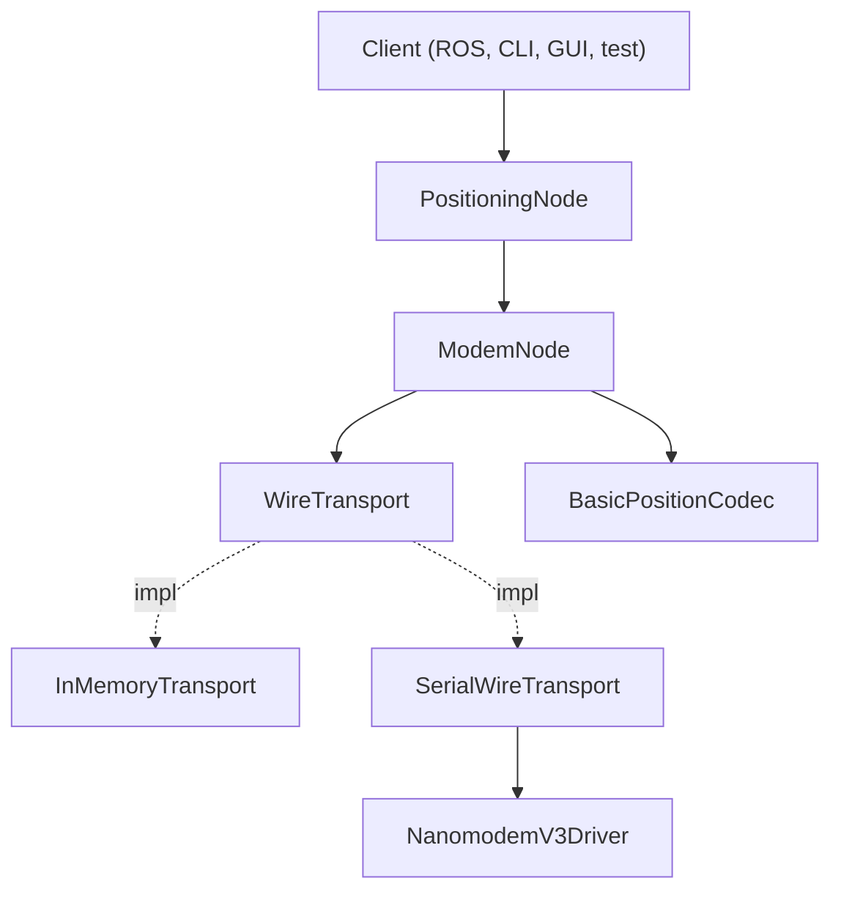

# Nanomodem Library

Python library for underwater acoustic positioning — trilaterate a submerged node's position using a network of surface beacons and acoustic range measurements.

## Installation

### Library Only

```bash
pip install "git+https://github.com/foxpoint-se/nanomodem-python.git#subdirectory=packages/nanomodem"
```

### Demo Applications

When installing from GitHub, pip cannot pull the library from the same repo automatically (unlike `uv sync` in the dev workspace). Install both:

```bash
pip install "git+https://github.com/foxpoint-se/nanomodem-python.git#subdirectory=packages/nanomodem"
pip install "git+https://github.com/foxpoint-se/nanomodem-python.git#subdirectory=packages/nanomodem-demo"
```

### For Developers (Local)

Clone and set up the full workspace (requires `uv`):

```bash
git clone https://github.com/foxpoint-se/nanomodem-python.git
cd nanomodem-python
make install
```

Run `make help` to see all available commands:

```bash
make test           # Run all tests
make lint           # Check for style and logical errors (Ruff)
make format         # Automatically format code (Ruff)
make typecheck      # Run strict type checking (Mypy)
make verify-dist    # Verify the core library is installable in a clean environment
make verify-dist-demo  # Verify the demo package is installable
```

## Usage

### Demo Scenarios (requires `nanomodem-demo`)

**4-node mock simulation (1 host + 3 beacons):**

```bash
uv run nanomodem-demo

# OR
source .venv/bin/activate
nanomodem-demo
```

**Single node UI (mock or serial):**

```bash
# Mock mode (no hardware)
uv run nanomodem-controller 001

# Real hardware
uv run nanomodem-controller 001 --port /dev/ttyUSB0
```

On startup the controller sends `$?` and **exits** if the modem's stored id does not match the id you passed.

**Speed of sound (ranging):** Defaults to **1500 m/s** (water). For air bench tests with ping/range, use **340 m/s**:

```bash
# Air bench (USB modems, map range circles)
uv run nanomodem-controller 001 --port /dev/ttyUSB0 --sound-speed 340
```

With the God View simulator, use the **same** `--sound-speed` on the simulator and every controller so simulated `#R` timestamps match decode.

**God View Simulator (multi-process testing):**

The simulator provides a "God View" of physical truth separate from controller belief, enabling realistic multi-terminal testing without hardware.

**Network mode (fast, multi-terminal logic testing):**

```bash
# Start simulator in one terminal
uv run nanomodem-simulator

# Connect controllers in other terminals
uv run nanomodem-controller 001 --network 127.0.0.1:5555
uv run nanomodem-controller 002 --network 127.0.0.1:5555

# Air bench (matching c on simulator + controllers)
uv run nanomodem-simulator --sound-speed 340
uv run nanomodem-controller 001 --network 127.0.0.1:5555 --sound-speed 340
```

**Serial mode (hardware-accurate stack testing with PTYs):**

```bash
# Start simulator in one terminal
uv run nanomodem-simulator

# Create PTY pair for Node 001 in another terminal
socat -d -d pty,raw,echo=0 pty,raw,echo=0
# Note the PTY paths (e.g., /dev/pts/4 and /dev/pts/5)

# Connect controller 001 in a third terminal
uv run nanomodem-controller 001 --port /dev/pts/4 --world 127.0.0.1:5555 --world-port /dev/pts/5

# Repeat for additional nodes
```

Serial mode tests the full `SerialWireTransport` and core driver stack — the same code that runs on the boat. Acoustic data flows through the PTY, while metadata (registration, GPS updates) flows through a TCP connection to the simulator.

**All-in-one serial test** (socat + simulator + two controllers in one process):

```bash
uv run python -m nanomodem_demo.scenarios.serial_bridge_with_god_view
```

### Real Hardware (Single Modem on Serial)

```python
from nanomodem import PositioningNode
from nanomodem.core.driver import NanomodemV3Driver
from nanomodem.core.modem_node import ModemNode
from nanomodem.core.transports import SerialWireTransport
from nanomodem.positioning import BasicPositionCodec
from nanomodem.types import Coord

driver = NanomodemV3Driver()
transport = SerialWireTransport(port="/dev/ttyUSB0", driver=driver)
modem = ModemNode("001", transport, BasicPositionCodec())
node = PositioningNode("001", modem)

transport.start()

node.set_position(Coord(lat=63.0, lon=10.0))
node.broadcast_position()
node.request_range("002")
node.request_test("002")
node.query_quality()
node.query_modem_status()

transport.stop()
```

### Two In-Memory Nodes (No Hardware)

```python
from nanomodem.constants import SOUND_SPEED_WATER_M_S
from nanomodem.core.transports import InMemoryBus, InMemoryTransport
from nanomodem.core.modem_node import ModemNode
from nanomodem import PositioningNode
from nanomodem.positioning import BasicPositionCodec
from nanomodem.types import Coord

bus = InMemoryBus(sound_speed=SOUND_SPEED_WATER_M_S)

def make_node(node_id: str, position: Coord) -> PositioningNode:
    transport = InMemoryTransport(node_id, bus)
    modem = ModemNode(node_id, transport, BasicPositionCodec())
    return PositioningNode(node_id, modem, position=position)

node_a = make_node("001", Coord(lat=63.0, lon=10.0))
node_b = make_node("002", Coord(lat=63.001, lon=10.0))

node_a.broadcast_position()
print(node_b.get_known_nodes())
```

### Text Mock Demo (no GUI)

```bash
uv run python -m nanomodem_demo.scenarios.text_mock_demo
```

For complete scenarios with GUI, trilateration, and multi-node setups, see `packages/nanomodem-demo/`.

## Architecture



**Layered design**: `nanomodem.core` handles wire protocol and transports; `nanomodem.positioning` adds LBL logic via **PositioningNode**.

**PositioningNode** wraps **ModemNode** with trilateration, known-node registry, and position broadcast helpers.

**WireTransport** implementations send `ModemCommand` and receive typed `ModemEvent`s. **InMemoryTransport** simulates an acoustic bus in-process; **SerialWireTransport** talks to real hardware via **NanomodemV3Driver**.

**BasicPositionCodec** encodes/decodes `PositionMessage` payloads inside broadcast/unicast data.

## Project Structure

```text
.
├── packages/
│   ├── nanomodem/              # Core library (pip installable)
│   │   └── src/nanomodem/
│   │       ├── core/           # Wire protocol, driver, ModemNode, transports
│   │       ├── positioning/    # PositioningNode, BasicPositionCodec, LBL math
│   │       ├── types.py        # Coord, PositionMessage, etc.
│   │       ├── calculation.py  # calculate_distance_3d
│   │       └── tests/
│   └── nanomodem-demo/         # GUI apps and scenarios (pip installable)
│       └── src/nanomodem_demo/
│           ├── controller.py   # Per-node ControllerWindow
│           ├── simulator/      # God View simulator (`nanomodem-simulator`)
│           └── scenarios/      # mock_4_nodes, single_node, serial_bridge, …
├── plans/TODO.md               # Forward-looking backlog
├── pyproject.toml              # Workspace root
└── README.md
```

## API Reference

### Node Capabilities

Nodes have two boolean capabilities that gate automatic behavior:

- `is_broadcasting_own_position` -- auto-broadcast when `set_position()` is called
- `is_inferring_own_position` -- auto-trilaterate when a new range response arrives and 3+ beacon positions/ranges are available

A "beacon" node sets `is_broadcasting_own_position = True`. A "submerged host" sets `is_inferring_own_position = True`. Both can be toggled independently on any node.

### Callbacks

PositioningNode accepts optional typed callbacks:

- `on_position_changed: Callable[[Optional[Coord]], None]`
- `on_depth_changed: Callable[[float], None]`
- `on_known_nodes_changed: Callable[[dict[str, KnownNode]], None]`

ModemNode accepts wire-level callbacks such as `on_event` for console logging.

GUI controllers use these with `root.after(0, ...)` for thread-safe reactive UI updates.

## IDE Integration

1. **Ruff Extension**: Install the [Ruff extension](https://marketplace.visualstudio.com/items?itemName=charliermarsh.ruff) for Cursor/VS Code.
2. **Format on Save**: Enable "Format on Save" in your editor settings and set Ruff as the default formatter.
3. **Mypy**: The `pyproject.toml` is configured for strict type checking. Most IDEs will pick this up automatically if you have a Python type-checking extension installed.
