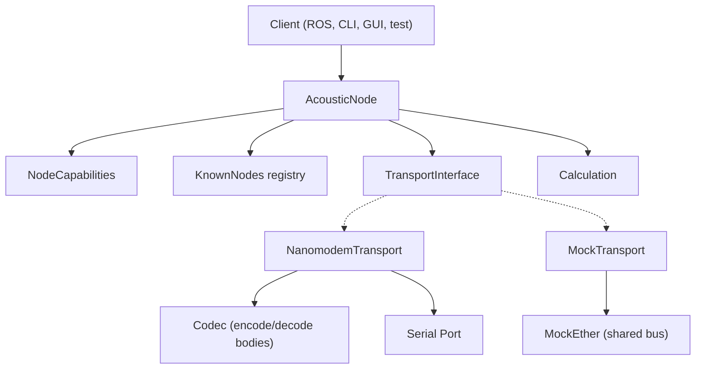

# Foxpoint Nanomodem Library

Professional, namespaced Python library (`foxpoint.nanomodem`) for underwater localization using acoustic modems (Nanomodem v3).

## Project Structure

```text
.
├── src/
│   └── foxpoint/
│       └── nanomodem/          # Core library (foxpoint.nanomodem)
│           ├── node.py         # AcousticNode — the only stateful class
│           ├── transport.py    # TransportInterface, MockTransport, MockEther
│           ├── nanomodem_transport.py  # Real serial transport
│           ├── codec.py        # Encode/decode message bodies
│           ├── calculation.py  # Trilateration, projection, timestamp conversion
│           ├── types.py        # Coord, KnownNode, Message union, etc.
│           ├── __main__.py     # CLI entry point (mock demo)
│           └── tests/          # 71 unit + integration tests
├── apps/
│   └── gui/                    # Tkinter GUI application
│       ├── controller.py       # Per-node ControllerWindow
│       ├── launcher.py         # Boots nodes + windows
│       └── __main__.py         # python -m gui
├── pyproject.toml
└── README.md
```

## Architecture



**AcousticNode** is the only stateful class. It holds its own position, depth, known nodes, and distances. Orchestrates communication and calculation via injected dependencies.

**Calculation** is stateless and pure. Trilateration (scipy least_squares), 3D-to-2D projection, timestamp-to-distance conversion.

**TransportInterface** defines two operations: `broadcast_position(coord)` and `request_range(target_id)`, plus `on_message(callback)` for receiving. Two implementations:

- **MockTransport** routes typed `Message` objects through a shared **MockEther** bus. No codec needed.
- **NanomodemTransport** wraps a serial port. Uses **Codec** internally to encode/decode message bodies. Formats `$P`, `$B`, `$M` commands. Parses `#` responses. Nothing received on serial is ever silently dropped -- everything becomes a typed `Message` (or `UnknownMessage` as catch-all).

**Codec** encodes/decodes message bodies (position data). Stateless, pure, injected into NanomodemTransport. The node never knows it exists.

## Installation

From the repository root:

```bash
python3 -m venv .venv
source .venv/bin/activate
pip install -e ".[dev]"
```

## Usage

### Mock Demo (No hardware needed)

```bash
export PYTHONPATH=$PYTHONPATH:$(pwd)/src
python3 -m foxpoint.nanomodem
```

### GUI (Mock mode)

```bash
export PYTHONPATH=$PYTHONPATH:$(pwd)/src:$(pwd)/apps
python3 -m gui
```

### Real Hardware

```bash
export PYTHONPATH=$PYTHONPATH:$(pwd)/src
python3 -m foxpoint.nanomodem --port /dev/ttyUSB0 --baud 9600 --node-id 001
```

## Development

### Running Tests

```bash
pytest
```

(The `pyproject.toml` is configured to look in `src/` and find the tests automatically.)

### Node Capabilities

Nodes have two boolean capabilities that gate automatic behavior:

- `is_broadcasting_own_position` -- auto-broadcast when `set_position()` is called
- `is_inferring_own_position` -- auto-trilaterate when a new range response arrives and 3+ beacon positions/ranges are available

A "beacon" node sets `is_broadcasting_own_position = True`. A "submerged host" sets `is_inferring_own_position = True`. Both can be toggled independently on any node.

### Callbacks

AcousticNode accepts two optional callbacks:

- `on_state_changed: Callable[[], None]` -- called whenever node state changes (position set, depth changed, message received)
- `on_message_received: Callable[[Message], None]` -- called with each incoming message for logging/display

GUI controllers use these with `root.after(0, ...)` for thread-safe reactive UI updates.
