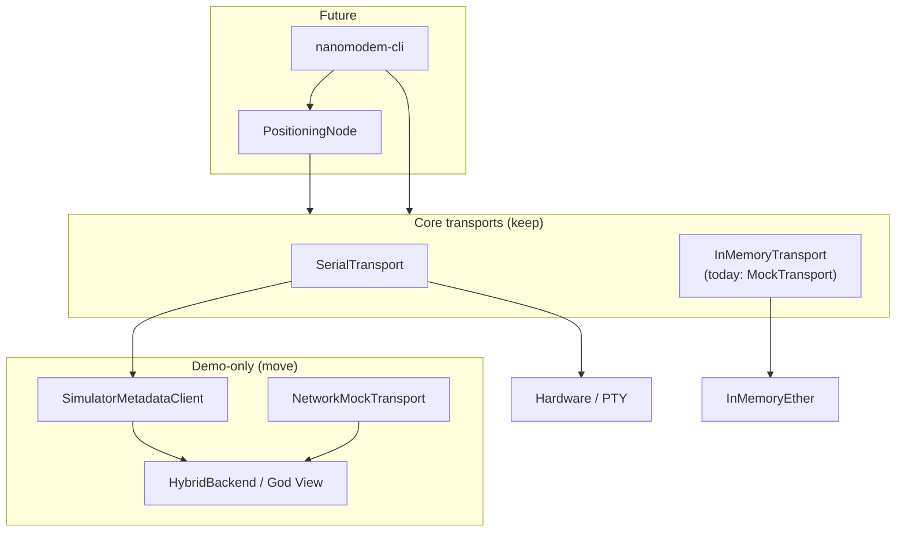

# Project inventory — keep / move / maybe

**Execution order:** [master-plan.md](./master-plan.md). Lookup table for steps 3–7 — which class goes where.

Overview of classes, protocols, and major modules across the workspace. Classification reflects the **layering refactor** discussions ([layering.md](./layering.md)).

**Legend**

| Tag | Meaning |
|-----|---------|
| **keep** | Belongs in core lib long-term (may rename) |
| **move** | Should live in another package or layer |
| **maybe** | Undecided, split, or rename under discussion |

---

## packages/nanomodem (core library)

### Protocols (`protocols.py`)

| Name | Kind | Verdict | Notes |
|------|------|---------|-------|
| `TransportProtocol` | Protocol | **keep** | Core plug-in point |
| `DriverProtocol` | Protocol | **keep** | v3 wire; narrow over time (payload-agnostic) |
| `CodecProtocol` | Protocol | **maybe** → `AppPayloadCodecProtocol` | Broader than position-only |
| `CalculationProtocol` | Protocol | **move** | Positioning layer only |

### Types & messages (`types.py`)

| Name | Kind | Verdict | Notes |
|------|------|---------|-------|
| `Coord` | dataclass | **keep** | Shared geographic type |
| `KnownNode` | dataclass | **move** | → positioning layer |
| `NodeCapabilities` | dataclass | **move** | → positioning layer |
| `PositionMessage` | dataclass | **keep** | App message (not user guide) |
| `RangeResponseMessage` | dataclass | **keep** | Wire type from driver |
| `QualityIndicatorMessage` | dataclass | **keep** | Wire type |
| `LocalAckMessage` | dataclass | **keep** | Wire type |
| `ModemStatusMessage` | dataclass | **keep** | Wire type |
| `V3TestBroadcastMessage` | dataclass | **keep** | v3 test payload detection |
| `UnknownMessage` | dataclass | **keep** | Catch-all |
| `Message` | type alias | **keep** | Union of above; may split wire vs app |
| — | (planned) | **maybe** | `PayloadBytes` wire type |

### Errors (`errors.py`)

| Name | Kind | Verdict | Notes |
|------|------|---------|-------|
| `ModemIdMismatchError` | exception | **keep** | Modem I/O |
| `ModemStatusTimeoutError` | exception | **keep** | Modem I/O |

### Node & math

| Name | Module | Verdict | Notes |
|------|--------|---------|-------|
| `AcousticNode` | `node.py` | **move** → `PositioningNode` | App layer; too opinionated for core |
| — | (planned) | **keep** | `ModemNode` — thin core orchestrator |
| `Calculation` | `calculation.py` | **move** | Positioning / LBL only |
| `calculate_distance_3d` | `calculation.py` | **move** | Used by demo relay + calc |

### Drivers (nanomodem v3 user guide)

| Name | Module | Verdict | Notes |
|------|--------|---------|-------|
| `NanomodemV3Driver` | `drivers/v3.py` | **keep** | Official serial protocol |
| `parse_status_line` | `drivers/v3_line_parsers.py` | **keep** | Pure line parsers |
| `parse_quality_line` | `drivers/v3_line_parsers.py` | **keep** | |
| `parse_local_ack_line` | `drivers/v3_line_parsers.py` | **keep** | |
| `supply_voltage_volts` | `drivers/v3_spec.py` | **keep** | User-guide formula |
| `normalize_modem_response_line` | `drivers/v3_spec.py` | **keep** | |
| `format_test_broadcast_line` | `drivers/v3_spec.py` | **keep** | v3 test payload |
| `parse_test_broadcast_sender` | `drivers/v3_spec.py` | **keep** | |
| `is_test_broadcast_line` | `drivers/v3_spec.py` | **keep** | |

### Codecs (application payloads — not user guide)

| Name | Module | Verdict | Notes |
|------|--------|---------|-------|
| `Codec` | `codecs/v3.py` | **maybe** → `BasicPositionCodec` | Misleading name; not v3 spec |

### Transports

| Name | Module | Verdict | Notes |
|------|--------|---------|-------|
| `SerialTransport` | `transports/serial.py` | **keep** | Hardware + PTY path |
| `MockTransport` | `transports/mock.py` | **maybe** → `InMemoryTransport` | High-level; no driver/codec |
| `MockEther` | `transports/mock.py` | **maybe** → `InMemoryEther` | In-process bus |
| `NetworkMockTransport` | `transports/network.py` | **move** → demo | God View JSON acoustic shortcut; not generic TCP |

### Simulator glue (currently in core — likely misplaced)

| Name | Module | Verdict | Notes |
|------|--------|---------|-------|
| `SimulatorMetadataClient` | `simulator_protocol.py` | **move** → demo | God View side channel |
| `SimulatorInboundHandlers` | `simulator_protocol.py` | **move** → demo | |
| `JsonLineBuffer` | `simulator_protocol.py` | **move** → demo | |
| `build_registration` | `simulator_protocol.py` | **move** → demo | |
| `build_transmit` | `simulator_protocol.py` | **move** → demo | |
| `send_json_line` | `simulator_protocol.py` | **move** → demo | |
| `dispatch_simulator_*` | `simulator_protocol.py` | **move** → demo | |
| `AcousticTransportConfig` | `sim_types.py` | **move** → demo | |
| `NodeRegistration` | `sim_types.py` | **move** → demo | |
| `TransmitMessage` | `sim_types.py` | **move** → demo | |
| `AcousticMessageEvent` | `sim_types.py` | **move** → demo | |
| `GPSUpdateMessage` | `sim_types.py` | **move** → demo | |

### Utilities

| Name | Module | Verdict | Notes |
|------|--------|---------|-------|
| `validate_sound_speed` | `constants.py` | **keep** | |
| `SOUND_SPEED_*` constants | `constants.py` | **keep** | |
| `format_serial_log` | `serial_logger.py` | **keep** | TX/RX logging at transport |

### Tests (core)

| Name | Module | Verdict | Notes |
|------|--------|---------|-------|
| `test_*.py` modules | `tests/` | **keep** | Move with code they test |
| `_RecordingTransport` etc. | test doubles | **keep** | In test files only |

---

## packages/nanomodem-demo

### GUI

| Name | Module | Verdict | Notes |
|------|--------|---------|-------|
| `ControllerWindow` | `controller.py` | **keep** | Demo package |
| `verify_modem_id_at_startup` | `startup.py` | **maybe** | Duplicate of eval; could share via future CLI/core |

### God View simulator

| Name | Module | Verdict | Notes |
|------|--------|---------|-------|
| `SimulatorWindow` | `simulator/app.py` | **keep** | Demo |
| `launch_simulator` | `simulator/app.py` | **keep** | Demo entry |
| `HybridBackend` | `simulator/backends.py` | **keep** | World model + relay |
| `SerialReader` | `simulator/backends.py` | **keep** | PTY reader for serial mode |
| `NodePhysicalState` | `simulator/state.py` | **keep** | God View truth |
| `NodeBeliefState` | `simulator/state.py` | **keep** | Controller belief |
| `SimulatorState` | `simulator/state.py` | **keep** | Aggregated sim state |

### Scenarios (entry modules — no classes)

| Module | Verdict | Notes |
|--------|---------|-------|
| `scenarios/mock_4_nodes.py` | **keep** | 4-node GUI mock |
| `scenarios/single_node.py` | **keep** | Controller launcher |
| `scenarios/text_mock_demo.py` | **keep** | No-GUI LBL demo |
| `scenarios/serial_bridge_2_nodes.py` | **keep** | Socat + broker + GUI |
| `scenarios/serial_bridge_with_god_view.py` | **keep** | All-in-one serial + God View |
| `scenarios/modem_relay.py` | **keep** | Byte-level relay helpers for sim/backends |
| `simulator/__main__.py` | **keep** | `nanomodem-simulator` CLI |

### Scenario helpers (`modem_relay.py` — functions, not classes)

| Function group | Verdict | Notes |
|----------------|---------|-------|
| `split_modem_command`, `parse_*`, `*_ack`, `relay_*` | **keep** | Demo/sim acoustic relay; v3 wire bytes |
| `distance_metres` | **keep** | Flat-earth for relay |

### Demo tests

| Module | Verdict |
|--------|---------|
| `tests/test_modem_relay.py` | **keep** |
| `tests/test_simulator_protocol.py` | **move** with protocol if relocated |

---

## Planned packages (not in repo yet)

| Name | Verdict | Notes |
|------|---------|-------|
| `nanomodem-cli` | **keep** | Thin CLI; see [cli-examples.md](./cli-examples.md) |
| `ModemNode` | **keep** | New core entry |
| `PositioningNode` | **move** from `AcousticNode` | LBL app on top of core |
| `BasicPositionCodec` | **maybe** | Rename from `Codec` |
| `InMemoryTransport` | **maybe** | Rename from `MockTransport` |

---

## Summary by verdict

### keep (core lib heart)

`TransportProtocol`, `DriverProtocol`, `NanomodemV3Driver`, line parsers, `SerialTransport`, wire message types, `Coord`, errors, constants, `serial_logger`, future `ModemNode`.

### move (out of core or renamed layer)

`AcousticNode` → `PositioningNode`, `Calculation` + `CalculationProtocol`, `KnownNode`, `NodeCapabilities`, all God View / simulator JSON types and clients, `NetworkMockTransport`.

### maybe (rename, split, or relocate)

`Codec` → `BasicPositionCodec`, `MockTransport`/`MockEther` → `InMemory*`, `CodecProtocol` scope, `verify_modem_id_at_startup` duplication, `TcpTransport` naming vs demo-only, wire vs app type split (`PayloadBytes`).

---

## Transport map (mental model)

**Serial + God View:** acoustic on `SerialTransport`, metadata on `SimulatorMetadataClient` (demo).  
**In-memory:** no God View required.  
**Network mode:** entire acoustic path over JSON (demo convenience) — optional, not core.
