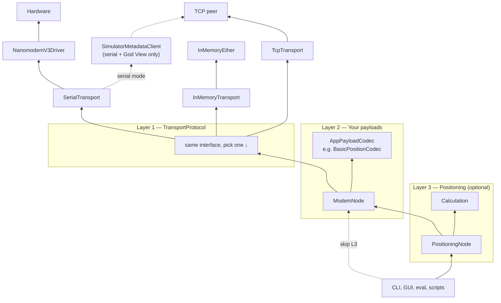
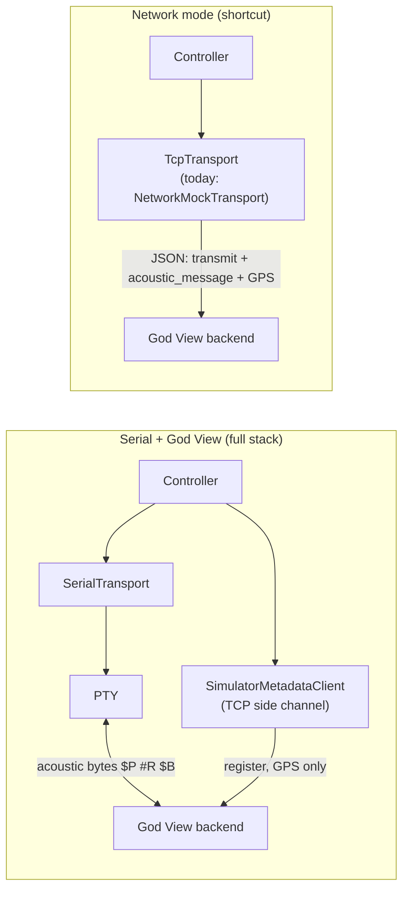
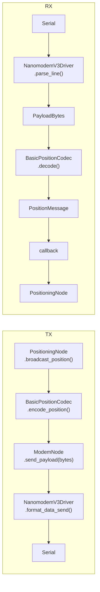
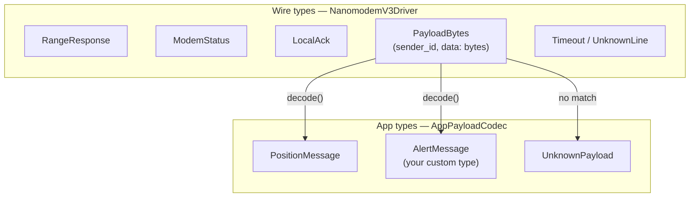

# Proposed library layering

**Execution order:** [master-plan.md](./master-plan.md). Architecture context for steps 4–7 — not the checklist itself.

Sketch for splitting **agnostic modem I/O** from **LBL positioning**. Not implemented.

See also: [cli-examples.md](./cli-examples.md).

---

## Three layers (intent)

| Layer | Responsibility | Nanomodem user guide? |
|-------|----------------|----------------------|
| **1 — Wire** | Official serial protocol: `$P`, `$?`, `#R`, `$B`/`$U` framing | yes |
| **2 — Payloads** | Your message formats: bytes ↔ app types (`BasicPositionCodec`, custom codecs) | no |
| **3 — Positioning** | LBL convenience: known nodes, ranges, trilateration | no |

Layer 3 is optional. Generic apps stop at layer 2 (or layer 1 for raw modem only).

---

## Simple picture



**Read it bottom-up:**

1. **Layer 1** — Pick a transport. All implement `TransportProtocol`. Upper layers don't care which one.
2. **Layer 2** — `ModemNode` + optional codec. Send/receive payloads, ping, status. Codec is **your** format inside `$B`/`$U` bytes — not in the user guide.
3. **Layer 3** — `PositioningNode` wraps `ModemNode` for maps and trilateration.

Also outside the stack: shared types (`Coord`, `PayloadBytes`, …), pure math (`Calculation`), clients (demo GUI, future CLI).

---

## Transports — one slot, three channels

Named by **medium** (like `SerialTransport`), not by "mock" or "simulator".

| Transport | Driver? | Codec? | Underneath | Purpose |
|-----------|---------|--------|------------|---------|
| `SerialTransport` | **yes** | **yes** (on data payloads) | `/dev/ttyUSB0` | Real hardware |
| `InMemoryTransport` | **no** | **no** | `InMemoryEther` (in-process bus) | Fast app-logic — "just make it happen" |
| `TcpTransport` | partly | partly | TCP peer (JSON protocol) | **Network mode only** — acoustic shortcut, no serial |

All plug into **`TransportProtocol`**. Layers 2–3 are identical regardless of backend.

### In-memory stays high-level (decided)

`InMemoryTransport` **skips driver and codec on purpose**. It routes typed `Message` objects directly through `InMemoryEther`:

- `request_range("002")` → `RangeResponseMessage` (no `$P`, no `#R`)
- `broadcast_position()` → peers get `PositionMessage` (no `$B`, no payload bytes)

**Do not change this.** In-memory is for exercising positioning logic quickly, not for verifying serial parsing.

For full-stack fidelity (driver + codec + bytes), use **`SerialTransport`** or **PTY passthrough** (demo God View serial mode).

### Two testing goals

| Goal | Tool |
|------|------|
| "Does positioning / known-nodes / trilateration work?" | `InMemoryTransport` |
| "Does driver + codec + serial path work?" | `SerialTransport` or PTY + God View |

### God View (demo, not core)

Lives in `nanomodem-demo`. The simulator backend (`HybridBackend`) is a **world model** — node positions, range math, GPS injection, relay between nodes.

**Important: God View uses TCP in two different ways.** Don't conflate them.



| Mode | Acoustic path | TCP used for |
|------|---------------|--------------|
| **Serial + God View** | `SerialTransport` → PTY — **real modem bytes** | Metadata only: registration, GPS updates (`SimulatorMetadataClient`) |
| **Network mode** | Same TCP socket as JSON — driver bytes base64'd, **no serial** | Everything: acoustic + GPS |

**Your original intent is serial mode:** nodes actually talk `$P` / `#R` / `$B` over PTY; TCP is just so God View knows where nodes are and can push virtual GPS.

**Network mode is a convenience shortcut** — multi-terminal without socat/PTY. Still uses driver to format bytes, but they never hit a serial port.

`SimulatorMetadataClient` is **not** a `TransportProtocol` — it's a side channel alongside `SerialTransport`. Only network mode replaces the acoustic transport entirely with TCP.

The core lib defines the JSON line protocol (`simulator_protocol.py`); the demo provides the God View backend.

---

## I/O thread and callbacks (decided)

| Concern | Owner |
|---------|-------|
| Background read loop (readline / socket) | **Transport** |
| Parse/format lines | **Driver** (serial path only) |
| Decode payload bytes | **Codec** (serial path, data messages only) |
| Raw TX/RX logging | **Transport** (`serial_logger` today) |
| App reacts to messages | **Callback** registered on transport/node |

**Receive path (serial):**

```
read thread → readline → driver.parse_line() → PayloadBytes or RangeResponse, …
             → (optional) codec.decode() → PositionMessage, …
             → callback upward
```

**Receive path (in-memory):**

```
request_range / broadcast → InMemoryEther → deliver typed Message → callback
(no thread, no driver, no codec)
```

**Receive path (TCP):**

```
read thread → socket → JSON line protocol → (driver/codec for acoustic bytes) → callback
```

Upper layers never touch the thread.

---

## Naming

### Transports (decided renames)

| Today | Target | Notes |
|-------|--------|-------|
| `MockTransport` | **`InMemoryTransport`** | In-process shared bus |
| `MockEther` | **`InMemoryEther`** | The shared acoustic medium |
| `NetworkMockTransport` | **`TcpTransport`** | Medium-based; no "mock" or "simulator" in API |
| `transports/mock.py` | `transports/in_memory.py` | Module path follows class |

Ship deprecated aliases for one release: `MockTransport = InMemoryTransport`, etc.

### Other names

| Prefix / name | Means | Example |
|---------------|-------|---------|
| `NanomodemV3*` | Official nanomodem v3 **serial protocol** (user guide) | `NanomodemV3Driver` |
| Wire types | Parsed hardware lines | `PayloadBytes`, `RangeResponse` |
| `PayloadBytes` | Opaque data from `#B` or `#U` — delivery method (`broadcast`/`unicast`) is metadata | — |
| `*Position*` | Application-layer LBL logic (not in user guide) | `PositioningNode`, `PositionMessage` |
| `Basic*` | Bundled default app implementation — simple, replaceable | `BasicPositionCodec` |
| `ModemNode` | Thin modem I/O — no positioning assumptions | — |

**Important:** `$B` / `$U` / `#B` / `#U` *framing* is nanomodem v3. The **payload bytes** inside (e.g. `P` + lat/lon text) are this library's own format, not specified by the modem user guide.

---

## Message flow (serial only)



Ping / status / `#R` skip the payload codec — driver produces wire types directly.

In-memory and TCP paths skip some or all of this — see transport table above.

---

## Building blocks

| Block | Layer | Responsibility |
|-------|-------|----------------|
| `NanomodemV3Driver` | 1 (serial only) | User-guide framing; `parse_line` → wire types |
| `SerialTransport` | 1 | Port I/O, read thread, driver integration |
| `InMemoryTransport` / `InMemoryEther` | 1 | Typed messages, in-process bus — **no driver/codec** |
| `TcpTransport` | 1 | TCP I/O, read thread, JSON line protocol |
| `AppPayloadCodecProtocol` | 2 | `bytes` ↔ app messages |
| `BasicPositionCodec` | 2 | Default text lat/lon/depth format (library default, not user guide) |
| `ModemNode` | 2 | `ping`, `status`, send/receive payloads, callbacks |
| `Calculation` | 3 | Trilateration, 3D→2D, timestamp→distance |
| `PositioningNode` | 3 | Known nodes, auto-broadcast/infer, trilateration |

---

## Type split (serial path)



In-memory skips wire types — delivers app types (`PositionMessage`, `RangeResponseMessage`, …) directly.

---

## Consumer imports (target)

### Serial — generic modem

```python
from nanomodem.drivers.v3 import NanomodemV3Driver
from nanomodem.modem_node import ModemNode
from nanomodem.transports.serial import SerialTransport

driver = NanomodemV3Driver()
transport = SerialTransport(node_id="001", port="/dev/ttyUSB0", driver=driver)
transport.start()

node = ModemNode(node_id="001", transport=transport)
node.ping("042")
node.send_payload(b"\x01")
node.on_message(lambda msg: print(msg))
```

### Serial — LBL positioning

```python
from nanomodem.codecs.basic_position import BasicPositionCodec
from nanomodem.positioning_node import PositioningNode
from nanomodem.transports.serial import SerialTransport
from nanomodem.types import Coord

transport = SerialTransport("001", "/dev/ttyUSB0", driver=NanomodemV3Driver())
transport.start()

node = PositioningNode("001", transport, codec=BasicPositionCodec())
node.set_position(Coord(lat=63.0, lon=10.0))
node.broadcast_position()
node.request_range("002")
node.calculate_position()
```

### In-memory — fast positioning (no driver/codec)

```python
from nanomodem.positioning_node import PositioningNode
from nanomodem.transports.in_memory import InMemoryEther, InMemoryTransport
from nanomodem.types import Coord

ether = InMemoryEther()
transport_a = InMemoryTransport("001", ether)
transport_b = InMemoryTransport("002", ether)
transport_a.position = Coord(lat=63.0, lon=10.0)
transport_b.position = Coord(lat=63.001, lon=10.0)

node_a = PositioningNode("001", transport_a)
node_b = PositioningNode("002", transport_b)

node_a.request_range("002")  # InMemoryEther → RangeResponseMessage, no serial
```

### TCP — network mode shortcut

```python
from nanomodem.positioning_node import PositioningNode
from nanomodem.transports.tcp import TcpTransport

transport = TcpTransport(node_id="001", host="127.0.0.1", port=5555)
transport.start()

node = PositioningNode("001", transport)
# Acoustic goes over TCP as JSON — no serial. God View backend relays bytes.
```

### Serial + God View — full stack (preferred for fidelity)

```python
from nanomodem.drivers.v3 import NanomodemV3Driver
from nanomodem.positioning_node import PositioningNode
from nanomodem.simulator_protocol import SimulatorInboundHandlers, SimulatorMetadataClient
from nanomodem.transports.serial import SerialTransport

transport = SerialTransport("001", "/dev/pts/4", driver=NanomodemV3Driver())
transport.start()

# Side channel — NOT a TransportProtocol; metadata + GPS only
metadata = SimulatorMetadataClient(
    node_id="001",
    host="127.0.0.1",
    port=5555,
    acoustic_transport={"type": "serial", "pty_path": "/dev/pts/5"},
    handlers=SimulatorInboundHandlers(on_gps_update=...),
)
metadata.start()

node = PositioningNode("001", transport)
# Acoustic: real bytes on PTY. God View: map + GPS over TCP.
```

### Custom payload codec

```python
from myapp.codecs import CompressedPositionCodec

node = PositioningNode("001", transport, codec=CompressedPositionCodec())
# PositioningNode speaks Coord; your codec owns bytes on the wire (serial path only)
```

---

## Migration from today

| Today | Target |
|-------|--------|
| `AcousticNode` | `PositioningNode` (+ deprecated alias) |
| — | `ModemNode` (new) |
| `Codec` | `BasicPositionCodec` in `codecs/basic_position.py` |
| `CodecProtocol` | `AppPayloadCodecProtocol` |
| `MockTransport` | `InMemoryTransport` (+ deprecated alias) |
| `MockEther` | `InMemoryEther` (+ deprecated alias) |
| `NetworkMockTransport` | `TcpTransport` (+ deprecated alias) — **network mode acoustic shortcut only** |
| — | `SimulatorMetadataClient` stays as TCP side channel with `SerialTransport` |
| `TransportProtocol.broadcast_position(coord, depth)` | generic send on `ModemNode`; position helper on `PositioningNode` |
| Driver owns codec | Driver returns `PayloadBytes`; codec on `ModemNode` (serial path) |
| In-memory philosophy | **unchanged** — typed messages, no driver/codec |

---

## What stays in demo / eval

GUI controllers, God View, scenarios → `PositioningNode` + chosen transport (`SerialTransport`, `InMemoryTransport`, or `TcpTransport`).

---

## Decisions vs open questions

### Decided

- Three layers: wire → payloads → positioning (optional).
- Transport names by medium: `SerialTransport` / `InMemoryTransport` / `TcpTransport`.
- No "mock" or "simulator" in public transport API.
- `InMemoryTransport` stays high-level — no driver/codec.
- `PayloadBytes` is delivery-agnostic (`#B` and `#U`).
- `BasicPositionCodec` naming — not `V3*` (v3 is driver/user-guide only).
- Read thread lives in transport; callbacks flow up.
- Full-stack tests use serial/PTY, not in-memory.

### Still open

- **RX decode site:** `ModemNode` vs `PositioningNode` for payload codec — pick one.
- **Multi-codec RX:** type byte prefix or codec chain when payloads differ.
- **Transport API cleanup:** move v3-specific command names toward driver/`ModemNode`; transport = I/O + dispatch.
