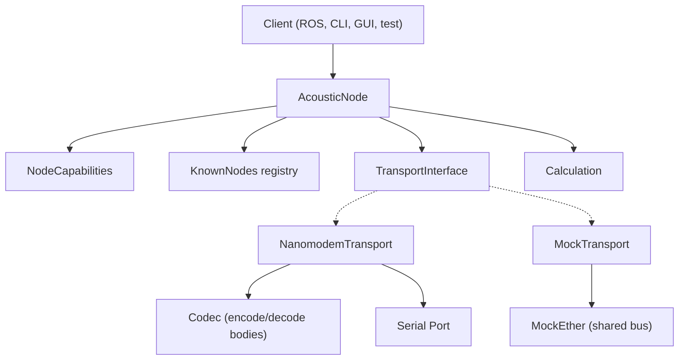

# Acoustic Modem Localization System

Layered system for underwater localization using acoustic modems (Nanomodem v3).

## Architecture



**AcousticNode** is the only stateful class. It holds its own position, depth, known nodes, and distances. Orchestrates communication and calculation via injected dependencies.

**Calculation** is stateless and pure. Trilateration (scipy least_squares), 3D-to-2D projection, timestamp-to-distance conversion.

**TransportInterface** defines two operations: `broadcast_position(coord)` and `request_range(target_id)`, plus `on_message(callback)` for receiving. Two implementations:

- **MockTransport** routes typed `Message` objects through a shared **MockEther** bus. No codec needed.
- **NanomodemTransport** wraps a serial port. Uses **Codec** internally to encode/decode message bodies. Formats `$P`, `$B`, `$M` commands. Parses `#` responses. Nothing received on serial is ever silently dropped -- everything becomes a typed `Message` (or `UnknownMessage` as catch-all).

**Codec** encodes/decodes message bodies (position data). Stateless, pure, injected into NanomodemTransport. The node never knows it exists.

## Install

```bash
cd take2
python3 -m venv .venv
source .venv/bin/activate
pip install -e ".[dev]"
```

## Run

### Mock demo (no hardware needed)

From the **parent** of `take2` (repo root):

```bash
python -m take2
```

From **inside** the `take2` folder (e.g. after `cd take2`):

```bash
PYTHONPATH=.. python -m take2
```

Do not run `python -m __main__` or `python __main__.py` from inside `take2` — the package must be imported as `take2` for relative imports to work.

Runs a scripted demo: 3 surface beacons + 1 submerged host. Beacons broadcast positions, host ranges to each, position is auto-calculated via trilateration.

### Real hardware

```bash
python -m take2 --port /dev/ttyUSB0 --baud 9600 --node-id 001
```

(NanomodemTransport is implemented but not yet wired into the entry point's main loop.)

## Tests

```bash
python -m pytest tests/ -v
```

52+ tests covering all layers: node, codec, transport, calculation, and integration.

If you have ROS sourced (e.g. `source /opt/ros/jazzy/setup.bash`), pytest may load ROS pytest plugins and fail with `ModuleNotFoundError: No module named 'yaml'`. Run with a clean path so only the venv is used:

```bash
PYTHONPATH= python -m pytest tests/ -v
```

## Node capabilities

Nodes have two boolean capabilities that gate automatic behavior:

- `is_broadcasting_own_position` -- auto-broadcast when `set_position()` is called
- `is_inferring_own_position` -- auto-trilaterate when a new range response arrives and 3+ beacon positions/ranges are available

A "beacon" node sets `is_broadcasting_own_position = True`. A "submerged host" sets `is_inferring_own_position = True`. Both can be toggled independently on any node.

## ROS transport (conceptual)

A ROS transport would implement `TransportInterface` using ROS topics as the communication medium. Each node runs in its own process, publishes to and subscribes from a shared topic. No intermediate routing node needed.

```python
import rclpy
from rclpy.node import Node as RosNode
from std_msgs.msg import String

class RosTransport:
    """TransportInterface implementation using ROS2 topics."""

    def __init__(self, node_id: str, ros_node: RosNode, topic: str = "/acoustic") -> None:
        self.node_id = node_id
        self._callback = None
        self._pub = ros_node.create_publisher(String, topic, 10)
        self._sub = ros_node.create_subscription(
            String, topic, self._on_ros_message, 10,
        )

    def broadcast_position(self, coord):
        # Encode and publish; all subscribers receive it
        msg = String()
        msg.data = f"{self.node_id}|POS|{coord.lat},{coord.lon},{coord.depth}"
        self._pub.publish(msg)

    def request_range(self, target_id):
        # Publish range request; target's transport picks it up
        msg = String()
        msg.data = f"{self.node_id}|RANGE_REQ|{target_id}"
        self._pub.publish(msg)

    def on_message(self, callback):
        self._callback = callback

    def _on_ros_message(self, ros_msg):
        # Filter own messages
        parts = ros_msg.data.split("|")
        if parts[0] == self.node_id:
            return
        # Parse and deliver to callback...
```

This is a conceptual example. The actual ROS transport would need proper message types, QoS settings, and threading considerations.
